# RabbitMQ基础
## 启篇

微服务一旦拆分，必然涉及到服务之间的相互调用，目前我们服务之间调用采用的都是基于OpenFeign的调用。这种调用中，调用者发起请求后需要**等待**服务提供者执行业务返回结果后，才能继续执行后面的业务。也就是说调用者在调用过程中处于阻塞状态，因此我们成这种调用方式为**同步调用**，也可以叫**同步通讯**。但在很多场景下，我们可能需要采用**异步通讯**的方式，为什么呢？

我们先来看看什么是同步通讯和异步通讯。如图

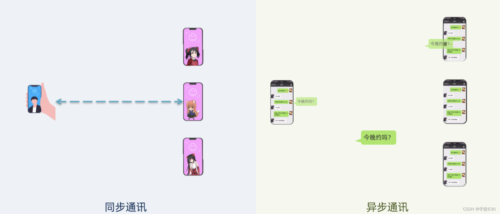

解读：

+   同步通讯：就如同打视频电话，双方的交互都是实时的。因此同一时刻你只能跟一个人打视频电话。
    
+   异步通讯：就如同发微信聊天，双方的交互不是实时的，你不需要立刻给对方回应。因此你可以多线操作，同时跟多人聊天。
    

两种方式各有优劣，打电话可以立即得到响应，但是你却不能跟多个人同时通话。发微信可以同时与多个人收发微信，但是往往响应会有延迟。

所以，如果我们的业务需要实时得到服务提供方的响应，则应该选择同步通讯（同步调用）。而如果我们追求更高的效率，并且不需要实时响应，则应该选择异步通讯（异步调用）。

同步调用的方式我们已经学过了，之前的OpenFeign调用就是。但是：

+   **异步调用又该如何实现？**
    
+   **哪些业务适合用异步调用来实现呢？**
    

通过今天的学习你就能明白这些问题了。

* * *

## 一、初识MQ

### 1.1 同步调用

 之前说过，我们现在基于OpenFeign的调用都属于是同步调用，那么这种方式存在哪些问题呢？ 举个例子，我们以昨天留给大家作为作业的**余额支付功能**为例来分析，首先看下整个流程：

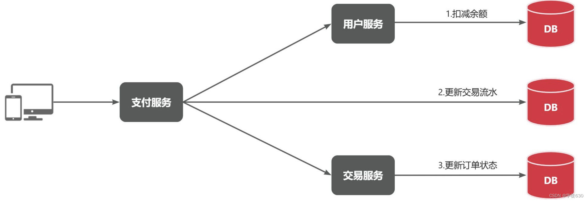

目前我们采用的是基于OpenFeign的同步调用，也就是说业务执行流程是这样的：

+   支付服务需要先调用用户服务完成余额扣减
    
+   然后支付服务自己要更新支付流水单的状态
    
+   然后支付服务调用交易服务，更新业务订单状态为已支付
    

三个步骤依次执行。 这其中就存在3个问题： **第一**，**拓展性差** 我们目前的业务相对简单，但是随着业务规模扩大，产品的功能也在不断完善。 在大多数电商业务中，用户支付成功后都会以短信或者其它方式通知用户，告知支付成功。假如后期产品经理提出这样新的需求，你怎么办？是不是要在上述业务中再加入通知用户的业务？ 某些电商项目中，还会有积分或金币的概念。假如产品经理提出需求，用户支付成功后，给用户以积分奖励或者返还金币，你怎么办？是不是要在上述业务中再加入积分业务、返还金币业务？ 。。。 最终你的支付业务会越来越臃肿：

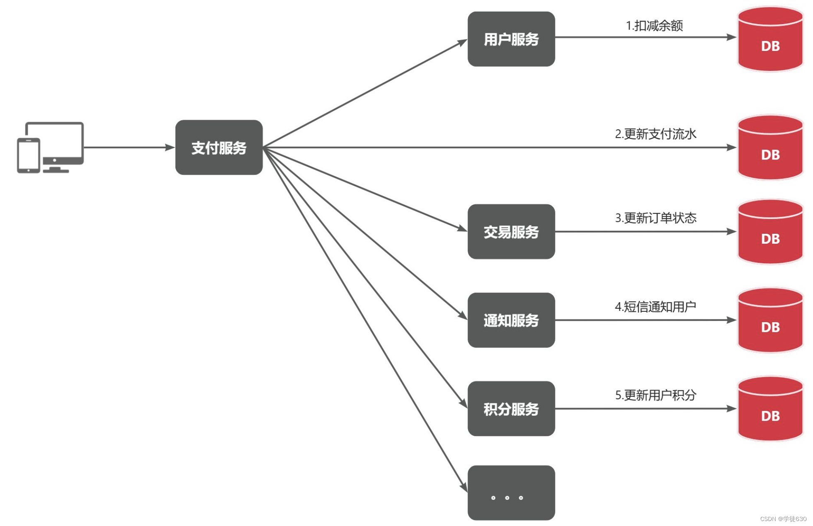

也就是说每次有新的需求，现有支付逻辑都要跟着变化，代码经常变动，不符合开闭原则，拓展性不好。

**第二**，**性能下降** 由于我们采用了同步调用，调用者需要等待服务提供者执行完返回结果后，才能继续向下执行，也就是说每次远程调用，调用者都是阻塞等待状态。最终整个业务的响应时长就是每次远程调用的执行时长之和：

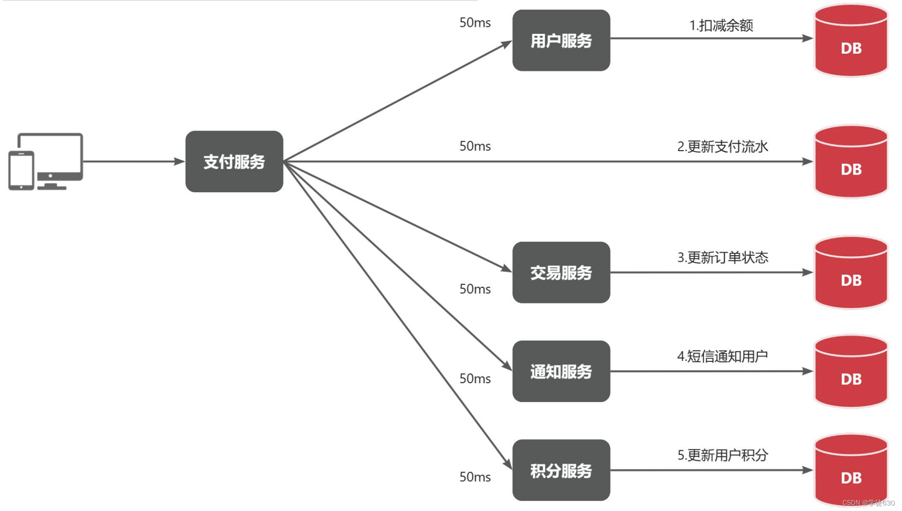

假如每个微服务的执行时长都是50ms，则最终整个业务的耗时可能高达300ms，性能太差了。

**第三，级联失败** 由于我们是基于OpenFeign调用交易服务、通知服务。当交易服务、通知服务出现故障时，整个事务都会回滚，交易失败。 这其实就是同步调用的**级联失败**问题。

但是大家思考一下，我们假设用户余额充足，扣款已经成功，此时我们应该确保支付流水单更新为已支付，确保交易成功。毕竟收到手里的钱没道理再退回去吧

因此，这里不能因为短信通知、更新订单状态失败而回滚整个事务。

综上，同步调用的方式存在下列问题：

+   拓展性差
    
+   性能下降
    
+   级联失败
    

而要解决这些问题，我们就必须用**异步调用**的方式来代替**同步调用**。

* * *

### 1.2异步调用

异步调用方式其实就是基于消息通知的方式，一般包含三个角色：

+   消息发送者：投递消息的人，就是原来的调用方
    
+   消息Broker：管理、暂存、转发消息，你可以把它理解成微信服务器
    
+   消息接收者：接收和处理消息的人，就是原来的服务提供方
    

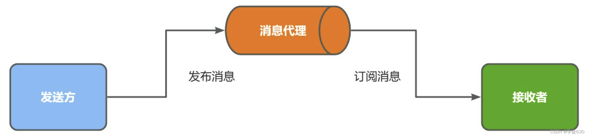

在异步调用中，发送者不再直接同步调用接收者的业务接口，而是发送一条消息投递给消息Broker。然后接收者根据自己的需求从消息Broker那里订阅消息。每当发送方发送消息后，接受者都能获取消息并处理。 这样，发送消息的人和接收消息的人就完全解耦了。

还是以余额支付业务为例：

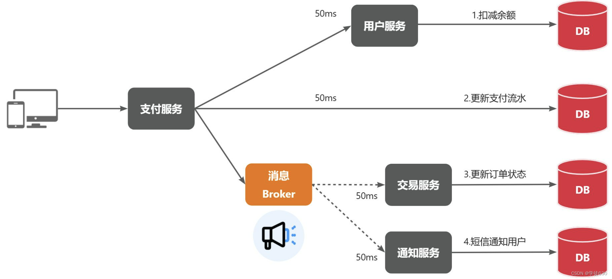

除了扣减余额、更新支付流水单状态以外，其它调用逻辑全部取消。而是改为发送一条消息到Broker。而相关的微服务都可以订阅消息通知，一旦消息到达Broker，则会分发给每一个订阅了的微服务，处理各自的业务。

假如产品经理提出了新的需求，比如要在支付成功后更新用户积分。支付代码完全不用变更，而仅仅是让积分服务也订阅消息即可：

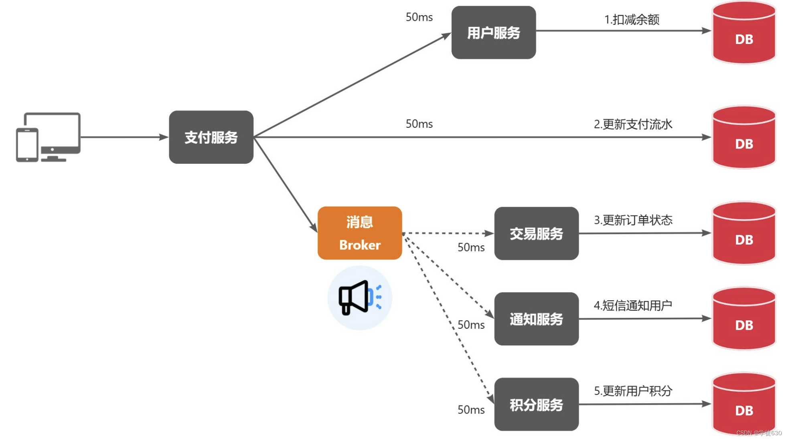

不管后期增加了多少消息订阅者，作为支付服务来讲，执行问扣减余额、更新支付流水状态后，发送消息即可。业务耗时仅仅是这三部分业务耗时，仅仅100ms，大大提高了业务性能。

另外，不管是交易服务、通知服务，还是积分服务，他们的业务与支付关联度低。现在采用了异步调用，解除了耦合，他们即便执行过程中出现了故障，也不会影响到支付服务。

综上，异步调用的优势包括：

> +   耦合度更低
>
> +   性能更好
>
> +   业务拓展性强
>
> +   故障隔离，避免级联失败
>

当然，异步通信也并非完美无缺，它存在下列缺点：

> +   完全依赖于Broker的可靠性、安全性和性能
>
> +   架构复杂，后期维护和调试麻烦
>

* * *

### 1.3 技术选型

 消息Broker，目前常见的实现方案就是消息队列（MessageQueue），简称为MQ. 目比较常见的MQ实现：

+   ActiveMQ
    
+   RabbitMQ
    
+   RocketMQ
    
+   Kafka
    

几种常见MQ的对比：

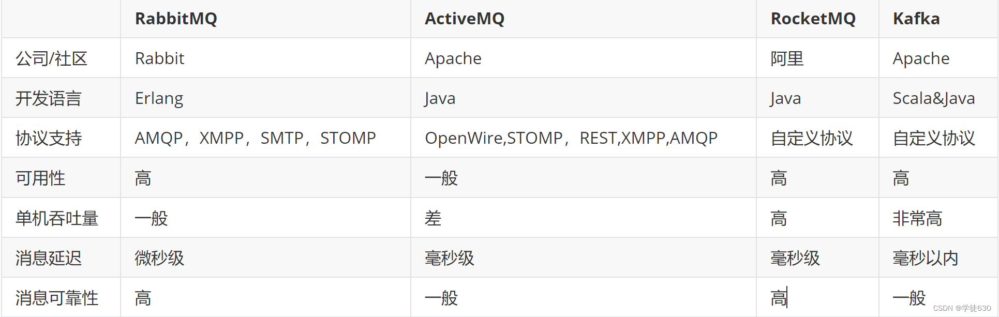

> +   **追求可用性：**Kafka、 RocketMQ 、RabbitMQ
> +   **追求可靠性：**RabbitMQ、RocketMQ
> +   **追求吞吐能力：**RocketMQ、Kafka
> +   **追求消息低延迟：**RabbitMQ、Kafka
>
> 据统计，目前国内消息队列使用最多的还是RabbitMQ，再加上其各方面都比较均衡，稳定性也好，因此我们课堂上选择RabbitMQ来学习。  

* * *

## 二、RabbitMQ

 RabbitMQ是基于Erlang语言开发的开源消息通信中间件，官网地址： [Messaging that just works — RabbitMQ](https://www.rabbitmq.com/ "Messaging that just works — RabbitMQ") 接下来，我们就学习它的基本概念和基础用法。

**这里的安装教程就不记录了，大家感兴趣的可以去找个配置文章跟着弄就好** 

### 架构

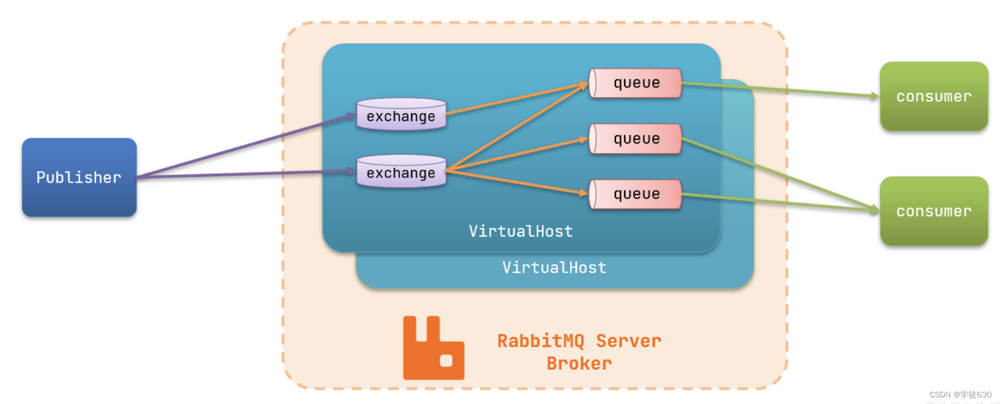

其中包含几个概念：

+   **`publisher`：**生产者，也就是发送消息的一方
    
+   **`consumer`：**消费者，也就是消费消息的一方
    
+   **`queue`：**队列，存储消息。生产者投递的消息会暂存在消息队列中，等待消费者处理
    
+   **`exchange`：**交换机，负责消息路由。生产者发送的消息由交换机决定投递到哪个队列。
    
+   **`virtual host`：**虚拟主机，起到数据隔离的作用。每个虚拟主机相互独立，有各自的exchange、queue
    

* * *

**下面我们学习一下在RabbitMQ控制台操作队列吧~**

### 2.2 收发消息

#### 2.2.1 交换机

我们打开Exchanges选项卡，可以看到已经存在很多交换机：

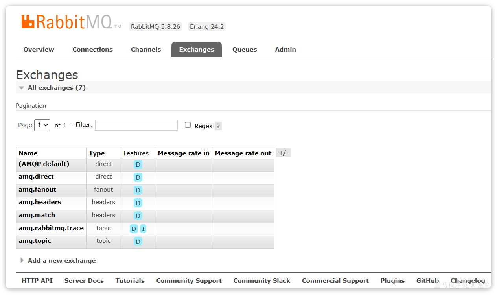

我们点击任意交换机，即可进入交换机详情页面。仍然会利用控制台中的publish message 发送一条消息：

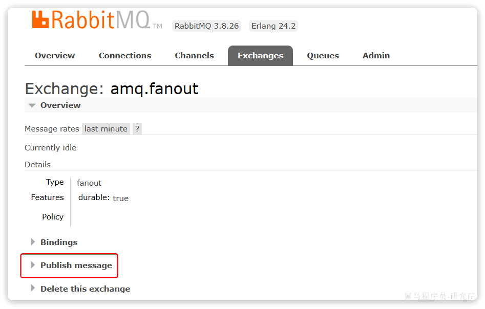

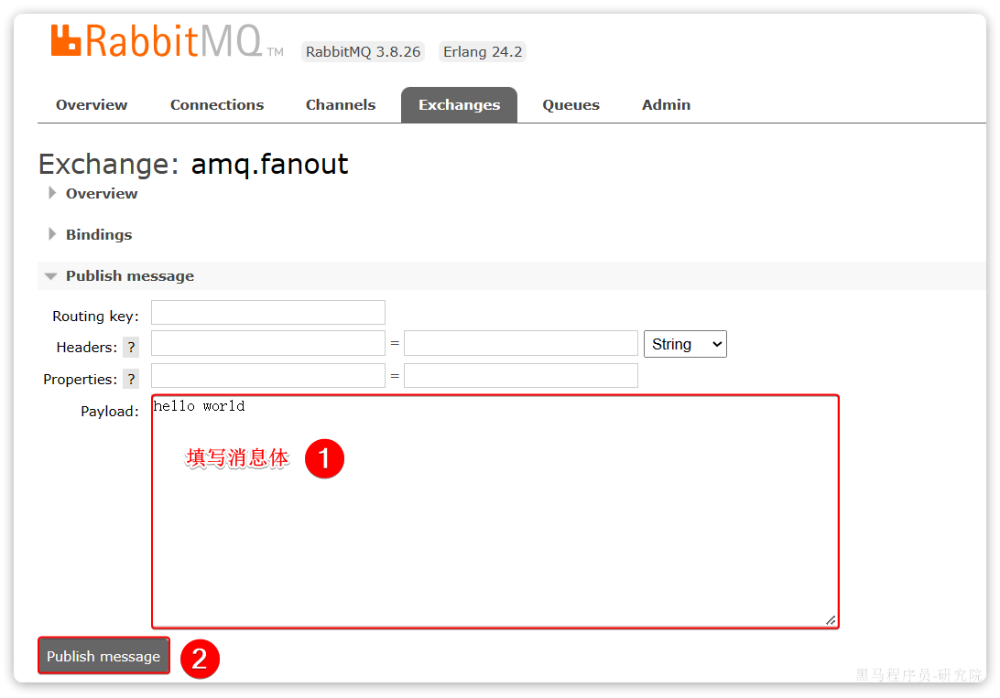

这里是由控制台模拟了生产者发送的消息。由于没有消费者存在，最终消息丢失了，这样说明交换机没有存储消息的能力。

#### 2.2.2 队列

我们打开`Queues`选项卡，新建一个队列：

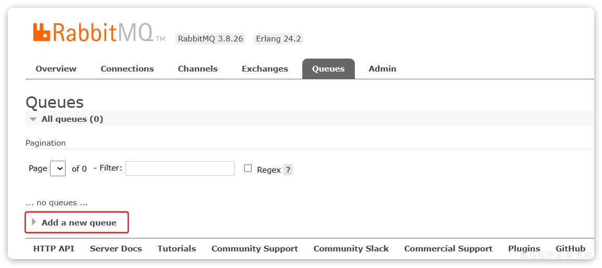

命名为`hello.queue1`：

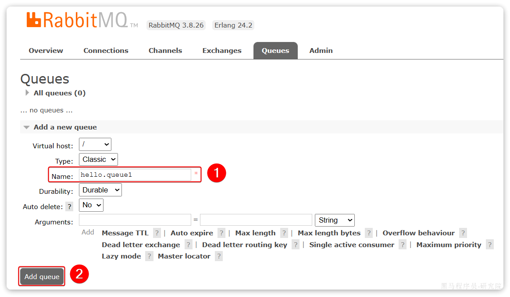

再以相同的方式，创建一个队列，密码为`hello.queue2`，最终队列列表如下：

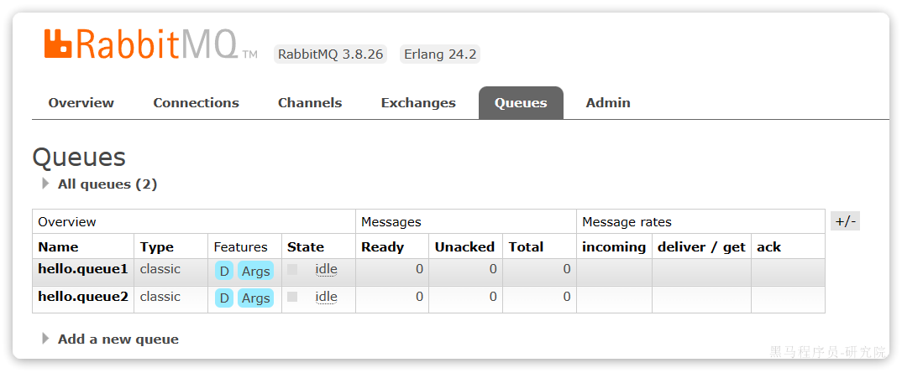

此时，我们再次向`amq.fanout`交换机发送一条消息。会发现消息依然没有到达队列！！ 怎么回事呢？ 发送到交换机的消息，只会路由到与其绑定的队列，因此仅仅创建队列是不够的，我们还需要将其与交换机绑定。

#### 2.2.3 绑定关系

点击`Exchanges`选项卡，点击`amq.fanout`交换机，进入交换机详情页，然后点击`Bindings`菜单，在表单中填写要绑定的队列名称：

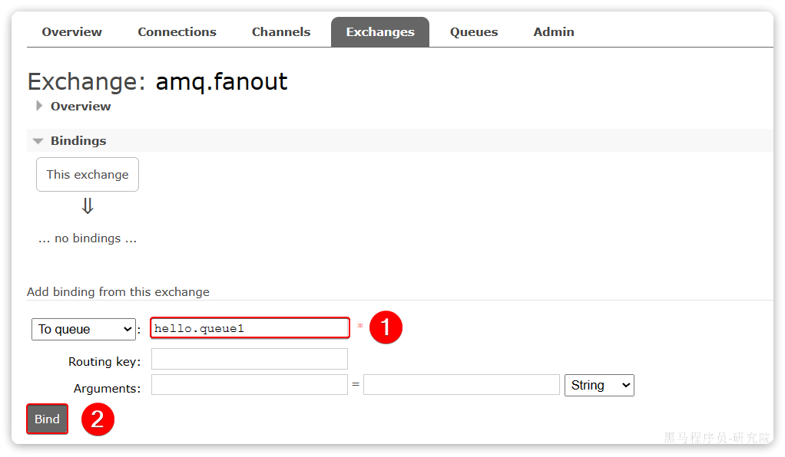

相同的方式，将hello.queue2也绑定到改交换机。 最终，绑定结果如下：

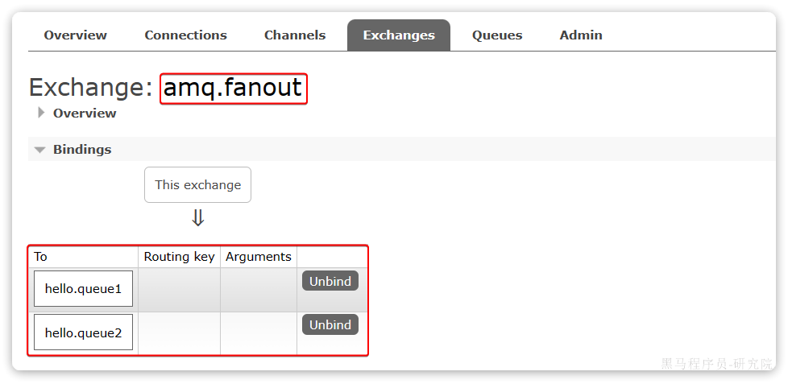

#### 2.2.4 发送消息

再次回到exchange页面，找到刚刚绑定的`amq.fanout`，点击进入详情页，再次发送一条消息：


回到`Queues`页面，可以发现`hello.queue`中已经有一条消息了：

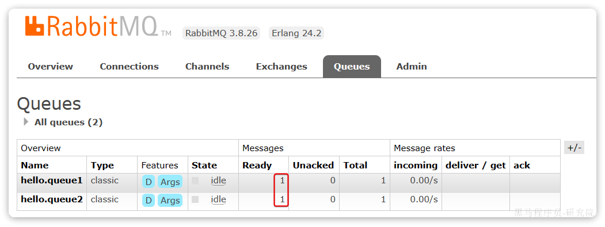

点击队列名称，进入详情页，查看队列详情，这次我们点击get message：

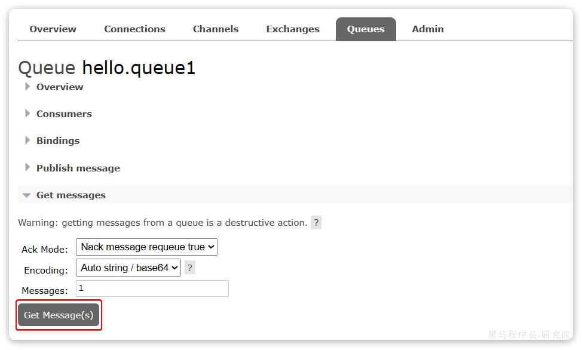

可以看到消息到达队列了：

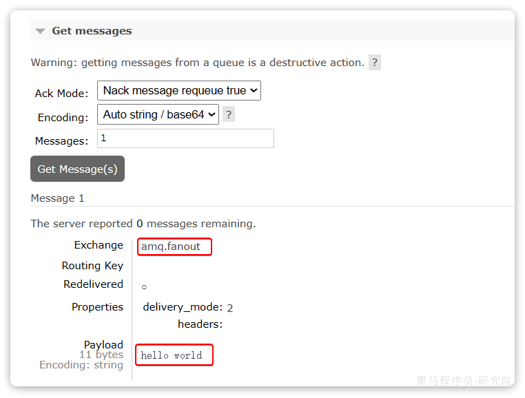

这个时候如果有消费者监听了MQ的`hello.queue1`或`hello.queue2`队列，自然就能接收到消息了。

### 2.3 数据隔离

#### 2.3.1 用户管理

点击`Admin`选项卡，首先会看到RabbitMQ控制台的用户管理界面：

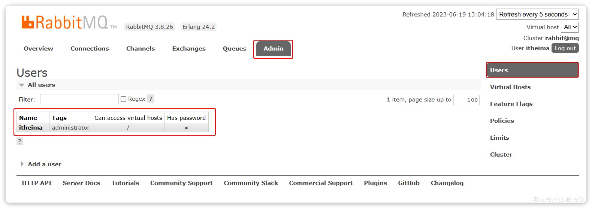

这里的用户都是RabbitMQ的管理或运维人员。目前只有安装RabbitMQ时添加的`itheima`这个用户。仔细观察用户表格中的字段，如下：

+   `Name`：`itheima`，也就是用户名
    
+   `Tags`：`administrator`，说明`itheima`用户是超级管理员，拥有所有权限
    
+   `Can access virtual host`： `/`，可以访问的`virtual host`，这里的`/`是默认的`virtual host`
    

对于小型企业而言，出于成本考虑，我们通常只会搭建一套MQ集群，公司内的多个不同项目同时使用。这个时候为了避免互相干扰， 我们会利用`virtual host`的隔离特性，将不同项目隔离。一般会做两件事情：

+   给每个项目创建独立的运维账号，将管理权限分离。
    
+   给每个项目创建不同的`virtual host`，将每个项目的数据隔离。
    

比如，我们给黑马商城创建一个新的用户，命名为`hmall`：

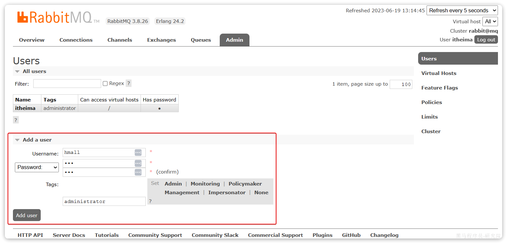

你会发现此时hmall用户没有任何`virtual host`的访问权限：

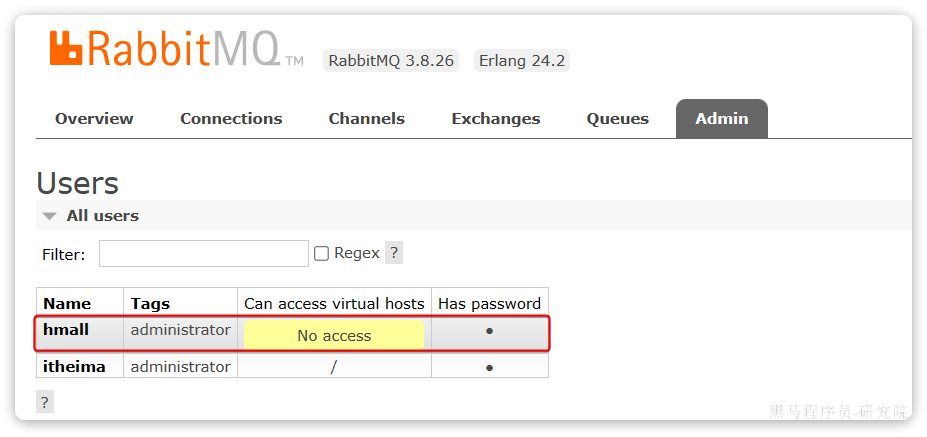

别急，接下来我们就来授权。

#### 2.3.2 virtual host

我们先退出登录：

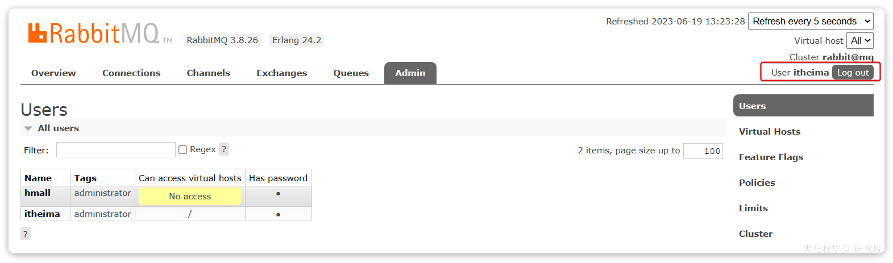

切换到刚刚创建的hmall用户登录，然后点击`Virtual Hosts`菜单，进入`virtual host`管理页：

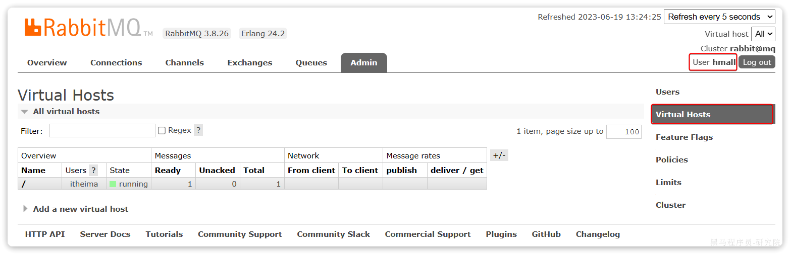

可以看到目前只有一个默认的`virtual host`，名字为 `/`。 我们可以给黑马商城项目创建一个单独的`virtual host`，而不是使用默认的`/`。

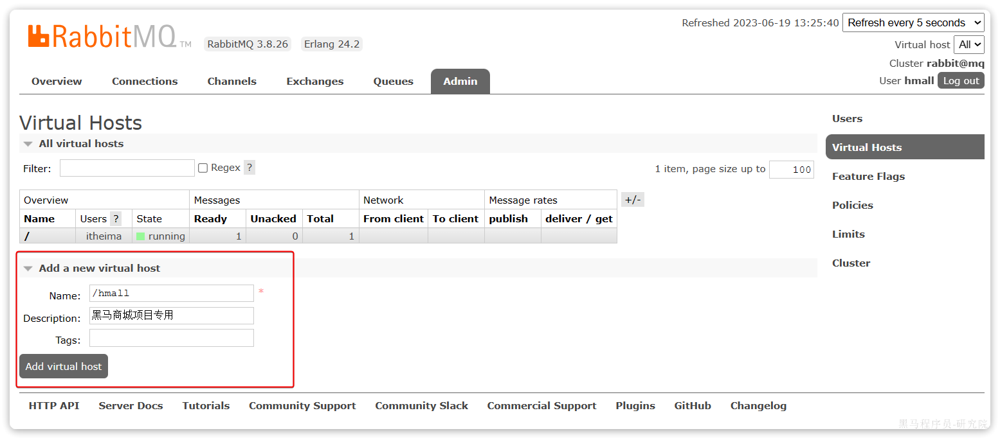

创建完成后如图：

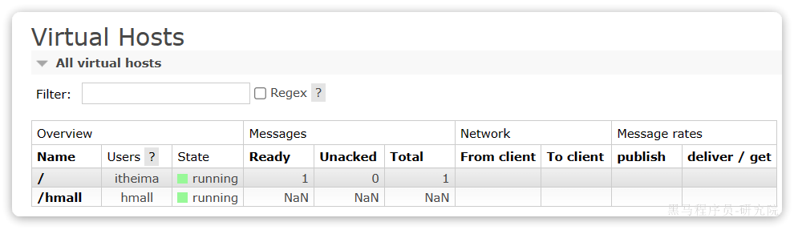

由于我们是登录`hmall`账户后创建的`virtual host`，因此回到`users`菜单，你会发现当前用户已经具备了对`/hmall`这个`virtual host`的访问权限了：

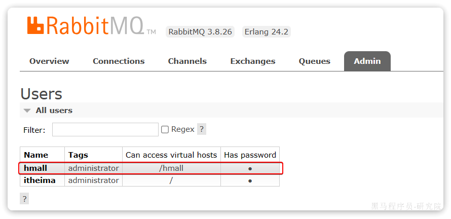

此时，点击页面右上角的`virtual host`下拉菜单，切换`virtual host`为 `/hmall`：

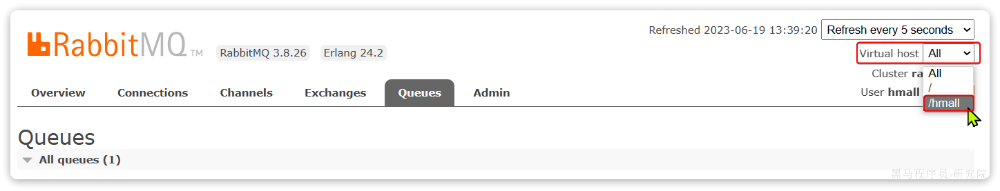

然后再次查看queues选项卡，会发现之前的队列已经看不到了： 这就是基于`virtual host`的隔离效果。

* * *

## 三、SpringAMQP

将来我们开发业务功能的时候，肯定不会在控制台收发消息，而是应该基于编程的方式。由于`RabbitMQ`采用了AMQP协议，因此它具备**跨语言**的特性。任何语言只要遵循AMQP协议收发消息，都可以与`RabbitMQ`交互。并且`RabbitMQ`官方也提供了各种不同语言的客户端。 但是，RabbitMQ官方提供的Java客户端编码相对复杂，一般生产环境下我们更多会结合Spring来使用。而Spring的官方刚好基于RabbitMQ提供了这样一套消息收发的模板工具：**SpringAMQP**。并且还基于SpringBoot对其实现了**自动装配**，使用起来非常方便。

SpringAmqp的官方地址： [Spring AMQP](https://spring.io/projects/spring-amqp "Spring AMQP") SpringAMQP提供了三个功能：

> +   自动声明队列、交换机及其绑定关系
>
> +   基于注解的监听器模式，异步接收消息
>
> +   封装了RabbitTemplate工具，用于发送消息
>

**注意：下面的演示中的队列、交换机等的创建绑定都是通过控制台手动进行配置，通过程序来启动配置的方式可以看3.4 API声明队列和交换机章节**

### 3.1 案例入门

#### 3.1.1 导入依赖

```XML
<!--AMQP依赖，包含RabbitMQ-->
<dependency>
   <groupId>org.springframework.boot</groupId>
   <artifactId>spring-boot-starter-amqp</artifactId>
</dependency>
```

在之前的案例中，我们都是经过交换机发送消息到队列，不过有时候为了测试方便，我们也**可以直接向队列发送消息，跳过交换机**。


+   publisher直接发送消息到队列
    
+   消费者监听并处理队列中的消息
    

**注意：**这种模式一般测试使用，很少在生产中使用。  

为了方便测试，我们现在控制台新建一个队列：simple.queue

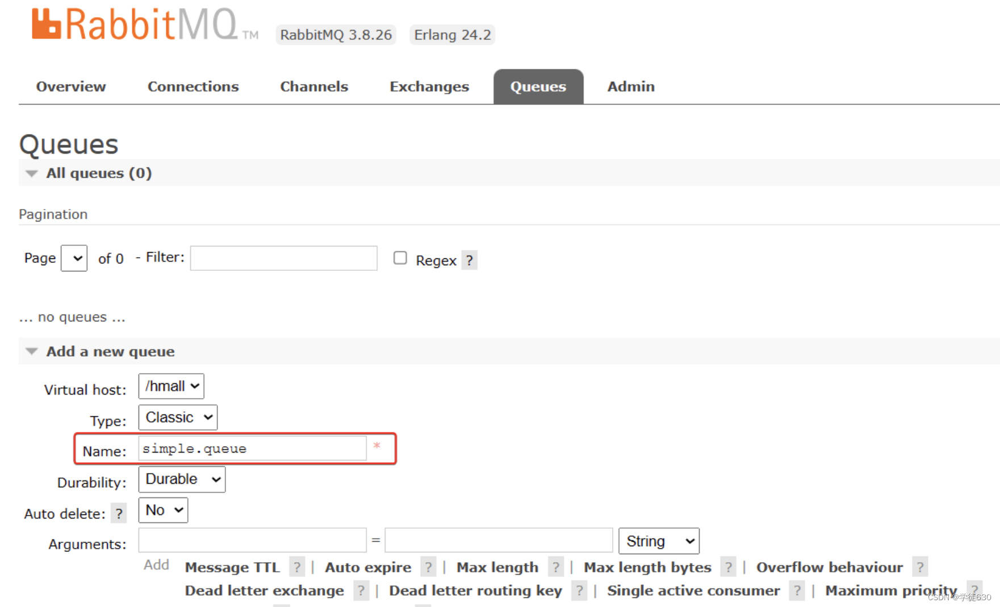

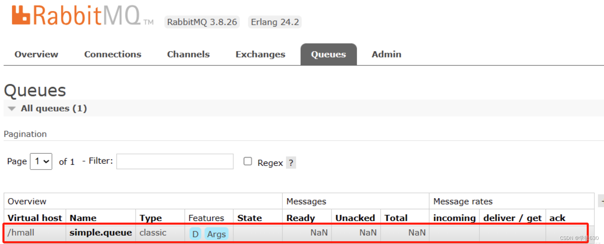

* * *

#### 3.1.2 消息发送

首先配置MQ地址，在`publisher`服务的`application.yml`中添加配置：

```XML
spring:
  rabbitmq:
    host: 192.168.150.101 # 你的虚拟机IP
    port: 5672 # 端口
    virtual-host: /hmall # 虚拟主机
    username: hmall # 用户名
    password: 123 # 密码
```

然后在**`发布者`**服务中编写测试类`SpringAmqpTest`，并利用`RabbitTemplate`实现消息发送：

```java
 @Autowired
    private RabbitTemplate rabbitTemplate;

    @Test
    public void testSimpleQueue() {
        // 队列名称
        String queueName = "simple.queue";
        // 消息
        String message = "hello, spring amqp!";
        // 发送消息
        rabbitTemplate.convertAndSend(queueName, message);
    }
```

 打开控制台，可以看到消息已经发送到队列中：

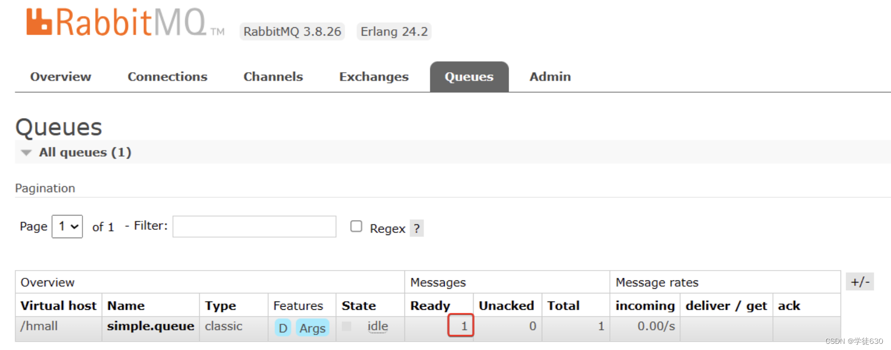

接下来，我们再来实现消息接收。

#### 3.1.2 消息接收

首先配置MQ地址，在`consumer`服务的`application.yml`中添加配置：

```java
spring:
  rabbitmq:
    host: 192.168.150.101 # 你的虚拟机IP
    port: 5672 # 端口
    virtual-host: /hmall # 虚拟主机
    username: hmall # 用户名
    password: 123 # 密码
```

 然后在 **消费者**服务的`com.itheima.consumer.listener`包中新建一个类`SpringRabbitListener`，代码如下：

```java
@Component
public class SpringRabbitListener {
	// 利用RabbitListener来声明要监听的队列信息
    // 将来一旦监听的队列中有了消息，就会推送给当前服务，调用当前方法，处理消息。
    // 可以看到方法体中接收的就是消息体的内容
    @RabbitListener(queues = "simple.queue")
    public void listenSimpleQueueMessage(String msg) throws InterruptedException {
        System.out.println("spring 消费者接收到消息：【" + msg + "】");
    }
}
```

运行结果

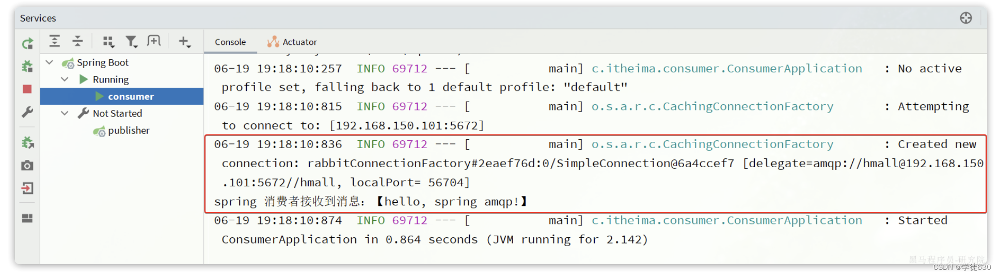

* * *

### 3.2 WorkQueues模型

Work queues，任务模型。简单来说就是**让多个消费者绑定到一个队列，共同消费队列中的消息**。

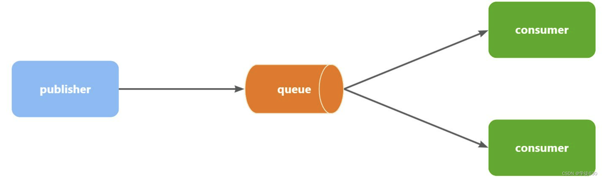

当消息处理比较耗时的时候，可能生产消息的速度会远远大于消息的消费速度。长此以往，消息就会堆积越来越多，无法及时处理。 此时就可以使用work 模型，**多个消费者共同处理消息处理，消息处理的速度就能大大提高**了。

接下来，我们就来模拟这样的场景。 首先，我们在控制台创建一个新的队列，命名为`work.queue`：

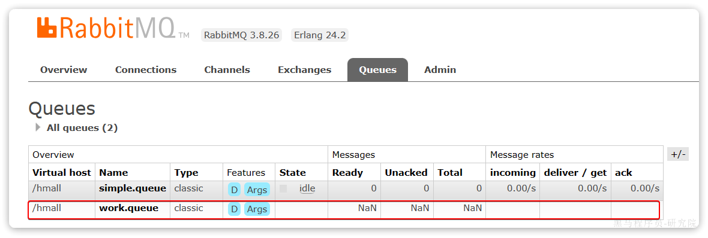

#### 3.2.1 消息发送

这次我们往队列中循环发送，模拟出一个**大量消息堆积**的队列。 

```java
/**
     * workQueue
     * 向队列中不停发送消息，模拟消息堆积。
     */
@Test
public void testWorkQueue() throws InterruptedException {
    // 队列名称
    String queueName = "simple.queue";
    // 消息
    String message = "hello, message_";
    for (int i = 0; i < 50; i++) {
        // 发送消息，每20毫秒发送一次，相当于每秒发送50条消息
        rabbitTemplate.convertAndSend(queueName, message + i);
        Thread.sleep(20);
    }
}
```

#### 3.2.2 消息接收

要模拟多个消费者绑定同一个队列，我们在consumer服务的SpringRabbitListener中添加2个新的方法：

```java
@RabbitListener(queues = "work.queue")
public void listenWorkQueue1(String msg) throws InterruptedException {
    System.out.println("消费者1接收到消息：【" + msg + "】" + LocalTime.now());
    Thread.sleep(20);
}

@RabbitListener(queues = "work.queue")
public void listenWorkQueue2(String msg) throws InterruptedException {
    System.err.println("消费者2........接收到消息：【" + msg + "】" + LocalTime.now());
    Thread.sleep(200);
}
```

注意到这两消费者，都设置了`Thead.sleep`，模拟任务耗时：

+   **消费者1 sleep了20毫秒，相当于每秒钟处理50个消息**
    
+   **消费者2 sleep了200毫秒，相当于每秒处理5个消息**
    

#### 3.2.3.测试

启动ConsumerApplication后，在执行publisher服务中刚刚编写的发送测试方法testWorkQueue。 最终结果如下：

消费者1和消费者2竟然**每人消费了25条消息**：

+   消费者1很快完成了自己的25条消息
    
+   消费者2却在缓慢的处理自己的25条消息。
    

也就是说消息是**平均分配**给每个消费者，并没有考虑到消费者的处理能力。导致1个消费者空闲，另一个消费者忙的不可开交。**没有充分利用每一个消费者的能力**，最终消息处理的耗时远远超过了1秒。这样显然是有问题的。

* * *

#### 3.2.4.能者多劳

在spring中有一个简单的配置，可以解决这个问题。我们修改**consumer服务**的application.yml文件，添加配置：

```XML
spring:
  rabbitmq:
    listener:
      simple:
        prefetch: 1 # 每次只能获取一条消息，处理完成才能获取下一个消息
```

> 在配置中，**\`prefetch: 1\`**表示每个消费者每次只能从队列中预取**1**个消息，消费完就能拿下一次，**不需要等轮询**。它可以帮助保证每个消息在被消费者处理时都能得到较为均匀的分配，避免某个消费者处理速度慢而导致其他消费者空闲的情况。**如果不配置着东东的话，那么rabbitmq采用的就是一个公平轮询的方式，将消息依次发给一个消费，等他消费完了再发下一个给另外的消费者**

* * *

### 3.3 交换机类型

在之前的两个测试案例中，都没有交换机，生产者直接发送消息到队列。而一旦引入交换机，消息发送的模式会有很大变化：

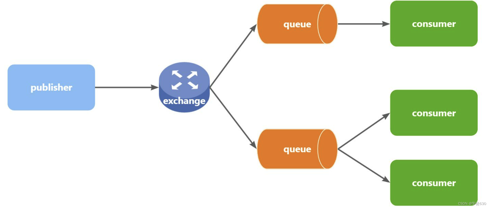

可以看到，在订阅模型中，多了一个exchange角色，而且过程略有变化：

+   **Publisher**：生产者，不再发送消息到队列中，而是发给交换机
    
+   **Exchange**：交换机，一方面，接收生产者发送的消息。另一方面，知道如何处理消息，例如递交给某个特别队列、递交给所有队列、或是将消息丢弃。到底如何操作，取决于Exchange的类型。
    
+   **Queue**：消息队列也与以前一样，接收消息、缓存消息。不过队列一定要与交换机绑定。
    
+   **Consumer**：消费者，与以前一样，订阅队列，没有变化
    

**Exchange（交换机）只负责转发消息，不具备存储消息的能力，因此如果没有任何队列与Exchange绑定，或者没有符合路由规则的队列，那么消息会丢失！**

**交换机的类型有四种：**

> +   **Fanout**：广播，将消息交给所有绑定到交换机的队列。我们最早在控制台使用的正是Fanout交换机
>
> +   **Direct**：订阅，基于RoutingKey（路由key）发送给订阅了消息的队列
>
> +   **Topic**：通配符订阅，与Direct类似，只不过RoutingKey可以使用通配符
>
> +   **Headers**：头匹配，基于MQ的消息头匹配，用的较少。
>

#### 3.3.1 Fanout交换机

Fanout，英文翻译是扇出，我觉得在MQ中叫广播更合适。 在广播模式下，消息发送流程是这样的：

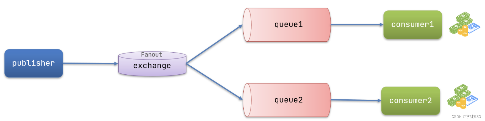

> +   1）  可以有多个队列
>
> +   2）  每个队列都要绑定到Exchange（交换机）
>
> +   3）  生产者发送的消息，只能发送到交换机
>
> +   4）  交换机把消息发送给绑定过的**所有队列**
>
> +   5）  订阅队列的消费者**都能拿到消息**  
>

##### 案例演示 

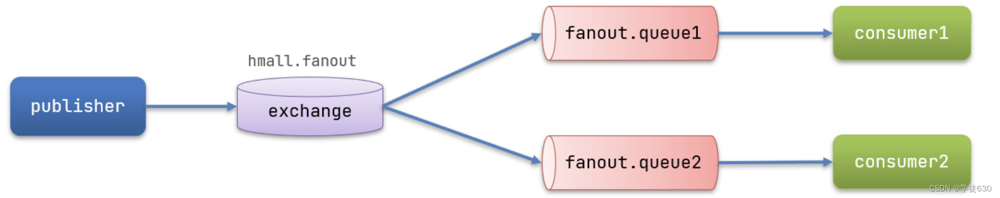

##### 3.3.1.1 声明队列和交换机

在控制台创建队列`fanout.queue1`:

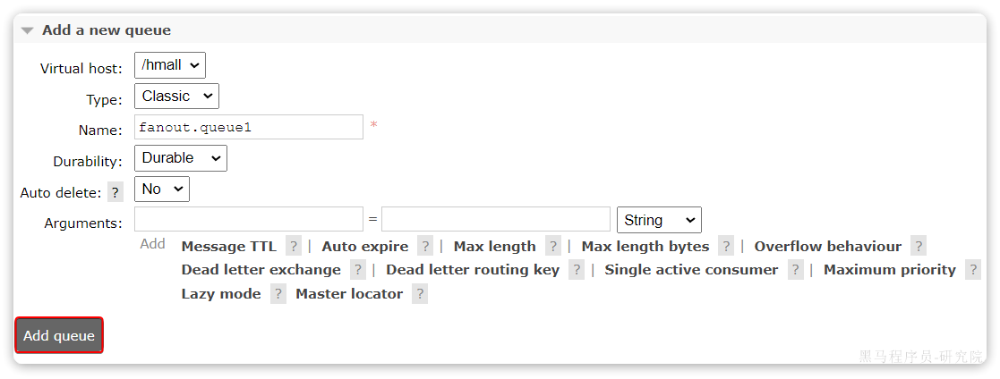

在创建一个队列`fanout.queue2`：

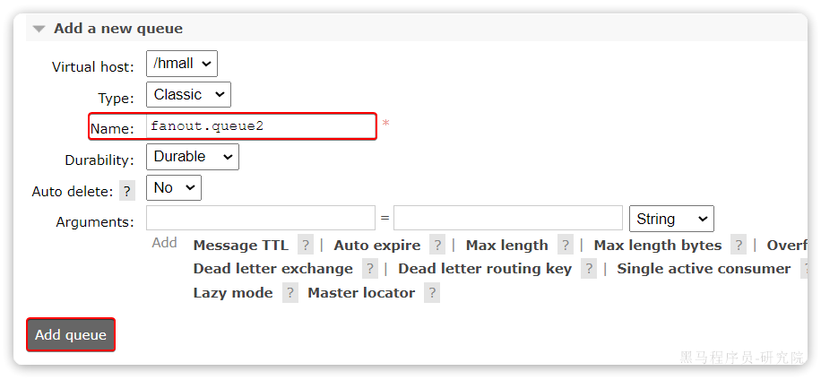

然后再创建一个交换机：

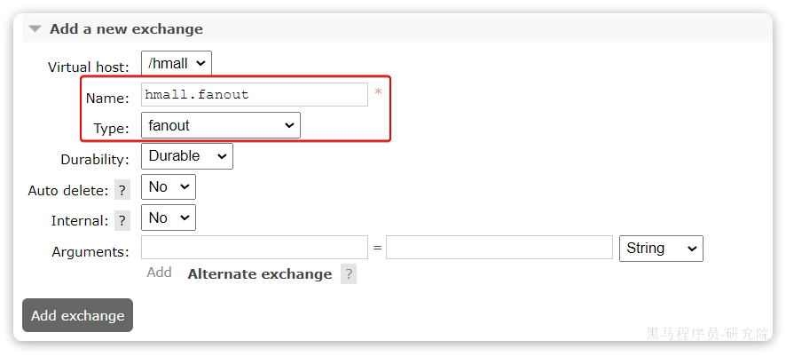

然后绑定两个队列到交换机：

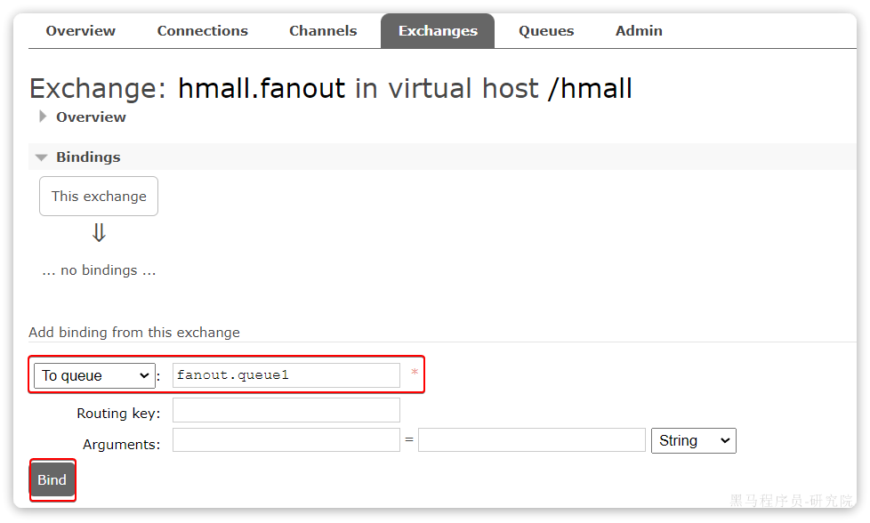

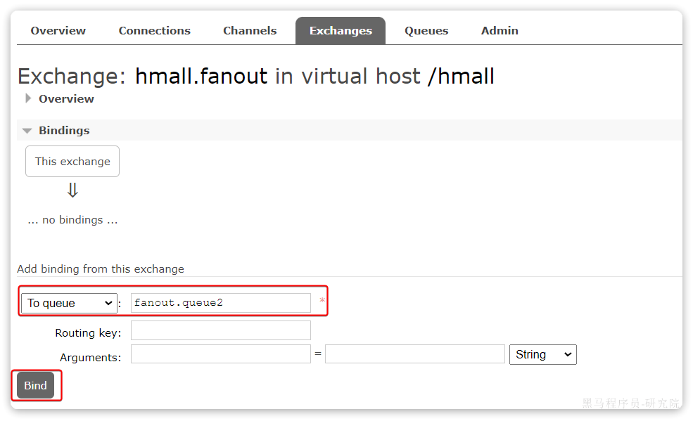

##### 3.3.1.2 消息发送

在publisher服务的SpringAmqpTest类中添加测试方法：

```java
@Test
public void testFanoutExchange() {
    // 交换机名称
    String exchangeName = "hmall.fanout";
    // 消息
    String message = "hello, everyone!";
    rabbitTemplate.convertAndSend(exchangeName, "", message);
}
```

##### 3.3.1.3 消息接收

在consumer服务的SpringRabbitListener中添加两个方法，作为消费者：

```java
@RabbitListener(queues = "fanout.queue1")
public void listenFanoutQueue1(String msg) {
    System.out.println("消费者1接收到Fanout消息：【" + msg + "】");
}

@RabbitListener(queues = "fanout.queue2")
public void listenFanoutQueue2(String msg) {
    System.out.println("消费者2接收到Fanout消息：【" + msg + "】");
}
```

##### 3.3.1.4 总结

交换机的作用是什么？

+   接收publisher发送的消息
    
+   将消息按照规则路由到与之绑定的队列
    
+   不能缓存消息，路由失败，消息丢失
    
+   FanoutExchange的会将消息路由到每个绑定的队列
    

* * *

#### 3.3.2 Direct交换机

在Fanout模式中，一条消息，会被所有订阅的队列都消费。但是，在某些场景下，我们希望不同的消息被不同的队列消费。这时就要用到Direct类型的Exchange。

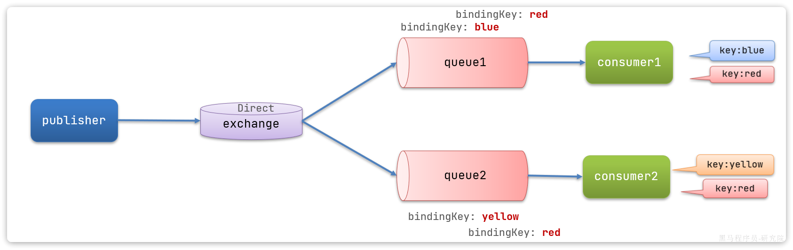

在Direct模型下：

+   队列与交换机的绑定，不能是任意绑定了，而是要指定一个`RoutingKey`（路由key）
    
+   消息的发送方在 向 Exchange发送消息时，也必须指定消息的 `RoutingKey`。
    
+   Exchange不再把消息交给每一个绑定的队列，而是根据消息的`Routing Key`进行判断，只有队列的`Routingkey`与消息的 `Routing key`完全一致，才会接收到消息
    

**案例需求如图**：

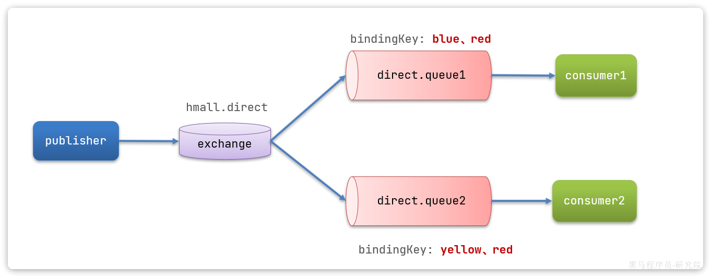

1.  声明一个名为`hmall.direct`的交换机
    
2.  声明队列`direct.queue1`，绑定`hmall.direct`，`bindingKey`为`blud`和`red`
    
3.  声明队列`direct.queue2`，绑定`hmall.direct`，`bindingKey`为`yellow`和`red`
    
4.  在`consumer`服务中，编写两个消费者方法，分别监听direct.queue1和direct.queue2
    
5.  在publisher中编写测试方法，向`hmall.direct`发送消息
    

##### 3.3.2.1 声明队列和交换机

首先在控制台声明两个队列`direct.queue1`和`direct.queue2`，这里不再展示过程：

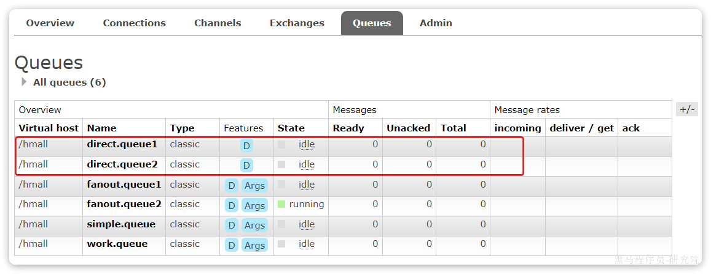

然后声明一个direct类型的交换机，命名为`hmall.direct`:

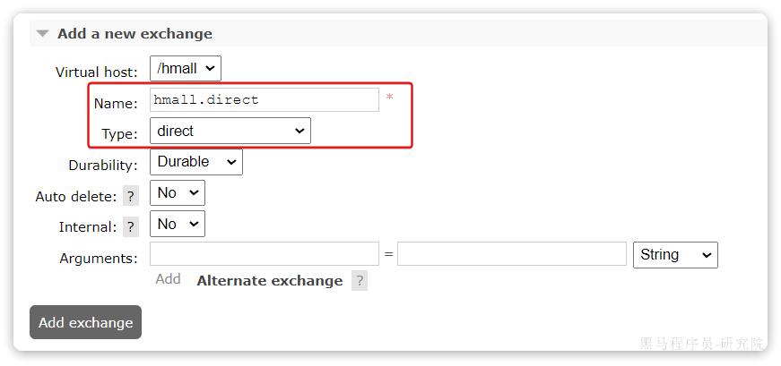

然后使用`red`和`blue`作为key，绑定`direct.queue1`到`hmall.direct`：

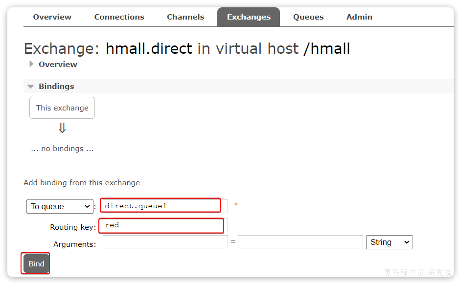

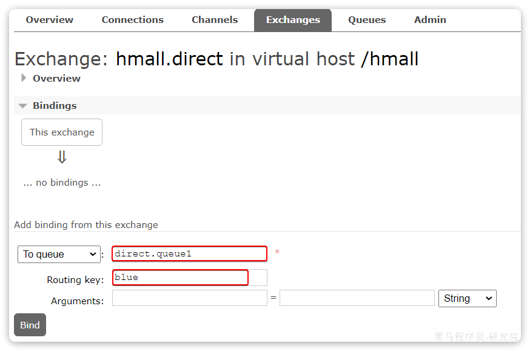

同理，使用`red`和`yellow`作为key，绑定`direct.queue2`到`hmall.direct`，步骤略，最终结果：

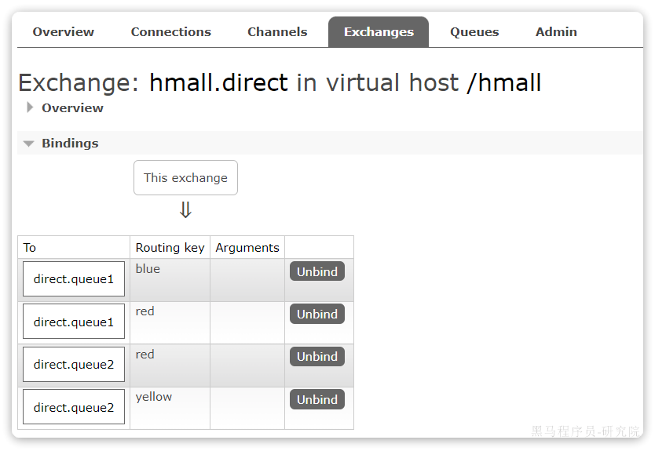

##### 3.3.2.2 消息接收

```java
在consumer服务的SpringRabbitListener中添加方法：

@RabbitListener(queues = "direct.queue1")
public void listenDirectQueue1(String msg) {
    System.out.println("消费者1接收到direct.queue1的消息：【" + msg + "】");
}

@RabbitListener(queues = "direct.queue2")
public void listenDirectQueue2(String msg) {
    System.out.println("消费者2接收到direct.queue2的消息：【" + msg + "】");
}
```

##### 3.3.2.3 消息发送

在publisher服务的SpringAmqpTest类中添加测试方法：

```java
@Test
public void testSendDirectExchange() {
    // 交换机名称
    String exchangeName = "hmall.direct";
    // 消息
    String message = "红色警报！日本乱排核废水，导致海洋生物变异，惊现哥斯拉！";
    // 发送消息
    rabbitTemplate.convertAndSend(exchangeName, "red", message);
}
```

由于使用的red这个key，所以两个消费者都收到了消息：

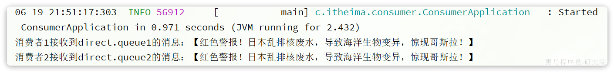

我们再切换为blue这个key：

```java
@Test
public void testSendDirectExchange() {
    // 交换机名称
    String exchangeName = "hmall.direct";
    // 消息
    String message = "最新报道，哥斯拉是居民自治巨型气球，虚惊一场！";
    // 发送消息
    rabbitTemplate.convertAndSend(exchangeName, "blue", message);
}
```

你会发现，只有消费者1收到了消息：

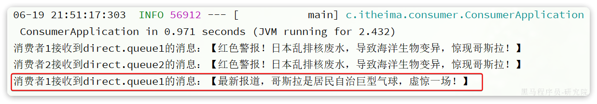

##### 3.3.2.4 总结

描述下Direct交换机与Fanout交换机的差异？

+   Fanout交换机将消息路由给每一个与之绑定的队列
    
+   Direct交换机根据RoutingKey判断路由给哪个队列
    
+   如果多个队列具有相同的RoutingKey，则与Fanout功能类似
    

* * *

#### 3.3.3 Topic交换机

##### 3.3.3.1.说明

> 尽管使用 direct 交换机改进了我们的系统，但是它仍然存在局限性——比方说我们的交换机绑定了多个不同的routingKey，在direct模式中虽然能做到有选择性地接收日志，但是它的选择性是单一的，就是说我的一条消息，只能被一个相同routingKey的绑定缩消费，但是如果我们想要在让它的选择性变得多元，比如**划分一个子组，一个消息可以根据一个组别的队列进行投递**，就需要用到Topics模式 

`Topic`类型`Exchange`可以让队列在绑定`BindingKey` 的时候使用**通配符**！

`BindingKey` 一般都是有一个或多个**单词**组成，多个单词之间以“ `**.**”`分割，例如： `item.insert`

通配符规则：

+   `#`：匹配一个或多个词
    
+   `*`：匹配不多不少恰好1个词
    

> 举例：
>
> +   `item.#`：能够匹配`item.spu.insert` 或者 `item.spu`
>
> +   `item.*`：只能匹配`item.spu`
>

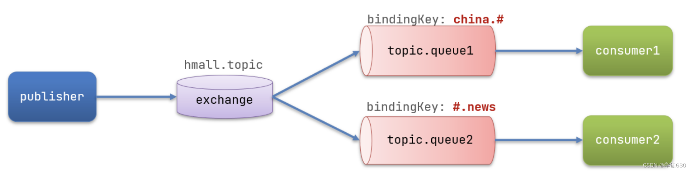

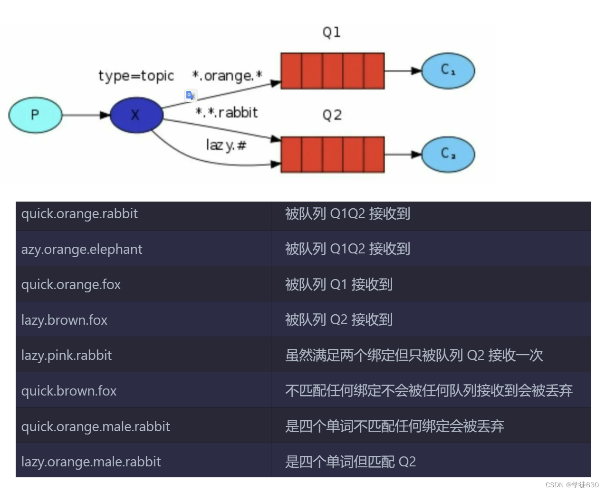

* * *

##### 3.3.2.1 声明队列和交换机

首先，在控制台按照图示例子创建队列、交换机，并利用通配符绑定队列和交换机。此处步骤略。最终结果如下：

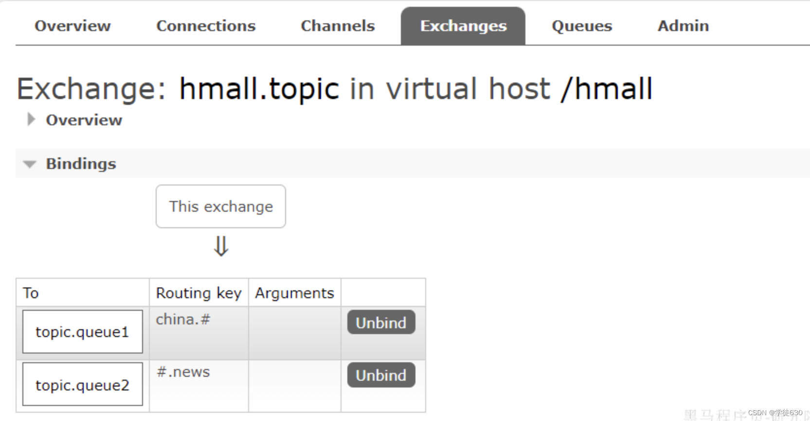

##### 3.3.2.2 消息发送

在publisher服务的SpringAmqpTest类中添加测试方法：

```java
/**
 * topicExchange
 */
@Test
public void testSendTopicExchange() {
    // 交换机名称
    String exchangeName = "hmall.topic";
    // 消息
    String message = "喜报！孙悟空大战哥斯拉，胜!";
    // 发送消息
    rabbitTemplate.convertAndSend(exchangeName, "china.news", message);
}
```

##### 3.3.2.3 消息接收

在consumer服务的SpringRabbitListener中添加方法：

```java
@RabbitListener(queues = "topic.queue1")
public void listenTopicQueue1(String msg){
    System.out.println("消费者1接收到topic.queue1的消息：【" + msg + "】");
}

@RabbitListener(queues = "topic.queue2")
public void listenTopicQueue2(String msg){
    System.out.println("消费者2接收到topic.queue2的消息：【" + msg + "】");
}
```

##### 3.3.2.4 总结

描述下Direct交换机与Topic交换机的差异？

+   Topic交换机接收的消息RoutingKey必须是多个单词，以 `**.**` 分割
    
+   Topic交换机与队列绑定时的bindingKey可以指定通配符
    
+   `#`：代表0个或多个词
    
+   `*`：代表1个词
    

* * *

### 3.4 API声明队列和交换机

在之前我们都是基于RabbitMQ控制台来创建队列、交换机。但是在实际开发时，队列和交换机是程序员定义的，将来项目上线，又要交给运维去创建。那么程序员就需要把程序中运行的所有队列和交换机都写下来，交给运维。在这个过程中是很容易出现错误的。 因此推荐的做法是由程序启动时检查队列和交换机是否存在，如果不存在自动创建。

#### 3.4.1.基本API

SpringAMQP提供了一个Queue类，用来创建队列：

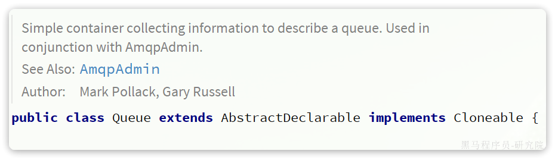

SpringAMQP还提供了一个Exchange接口，来表示所有不同类型的交换机：

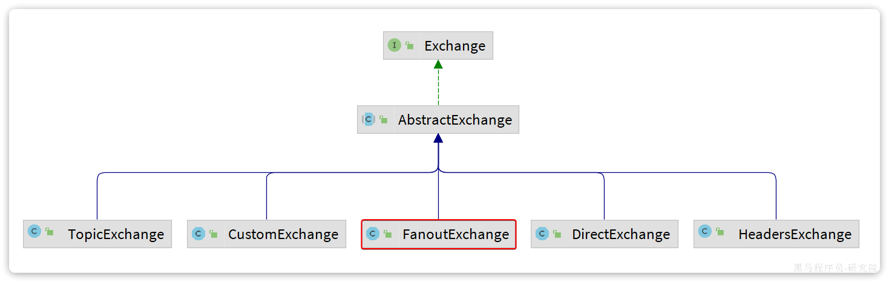

我们可以自己创建队列和交换机，不过SpringAMQP还提供了**ExchangeBuilder**来简化这个过程： 

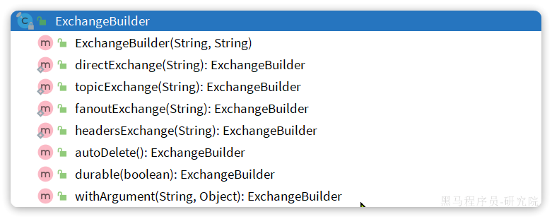

而在绑定队列和交换机时，则需要使用BindingBuilder来创建Binding对象：

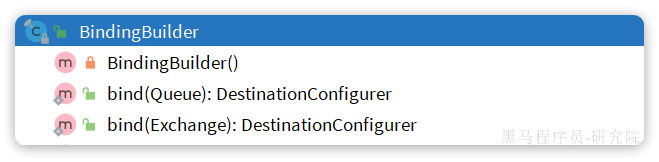

#### 3.4.2.fanout示例

在consumer中创建一个**配置类**，声明队列和交换机：


```java
@Configuration
public class FanoutConfig {
    /**
     * 声明交换机
     * @return Fanout类型交换机
     */
    @Bean
    public FanoutExchange fanoutExchange(){
        return new FanoutExchange("hmall.fanout");
    }

    /**
     * 第1个队列
     */
    @Bean
    public Queue fanoutQueue1(){
        return new Queue("fanout.queue1");
    }

    /**
     * 绑定队列和交换机
     */
    @Bean
    public Binding bindingQueue1(Queue fanoutQueue1, FanoutExchange fanoutExchange){
        return BindingBuilder.bind(fanoutQueue1).to(fanoutExchange);
    }

    /**
     * 第2个队列
     */
    @Bean
    public Queue fanoutQueue2(){
        return new Queue("fanout.queue2");
    }

    /**
     * 绑定队列和交换机
     */
    @Bean
    public Binding bindingQueue2(Queue fanoutQueue2, FanoutExchange fanoutExchange){
        return BindingBuilder.bind(fanoutQueue2).to(fanoutExchange);
    }
}
```

* * *

#### 3.4.2.direct示例

direct模式由于要绑定多个KEY，会非常麻烦，每一个Key都要编写一个binding：

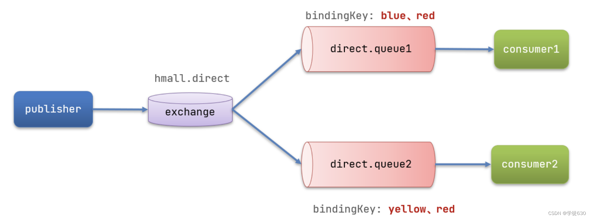

```java
@Configuration
public class DirectConfig {

    /**
     * 声明交换机
     * @return Direct类型交换机
     */
    @Bean
    public DirectExchange directExchange(){
        return ExchangeBuilder.directExchange("hmall.direct").build();
    }

    /**
     * 第1个队列
     */
    @Bean
    public Queue directQueue1(){
        return new Queue("direct.queue1");
    }

    /**
     * 绑定队列和交换机
     */
    @Bean
    public Binding bindingQueue1WithRed(Queue directQueue1, DirectExchange directExchange){
        return BindingBuilder.bind(directQueue1).to(directExchange).with("red");
    }
    /**
     * 绑定队列和交换机
     */
    @Bean
    public Binding bindingQueue1WithBlue(Queue directQueue1, DirectExchange directExchange){
        return BindingBuilder.bind(directQueue1).to(directExchange).with("blue");
    }

    /**
     * 第2个队列
     */
    @Bean
    public Queue directQueue2(){
        return new Queue("direct.queue2");
    }

    /**
     * 绑定队列和交换机
     */
    @Bean
    public Binding bindingQueue2WithRed(Queue directQueue2, DirectExchange directExchange){
        return BindingBuilder.bind(directQueue2).to(directExchange).with("red");
    }
    /**
     * 绑定队列和交换机
     */
    @Bean
    public Binding bindingQueue2WithYellow(Queue directQueue2, DirectExchange directExchange){
        return BindingBuilder.bind(directQueue2).to(directExchange).with("yellow");
    }
}
```

**Topic和Direct基本是一样的配置方式，这里就不掩饰了**  

* * *

#### 3.4.4.基于注解声明

基于@Bean的方式声明队列和交换机比较麻烦，Spring还提供了基于注解方式来声明。

例如，我们同样声明Direct模式的交换机和队列：

```java
@RabbitListener(bindings = @QueueBinding(
    value = @Queue(name = "direct.queue1"),
    exchange = @Exchange(name = "hmall.direct", type = ExchangeTypes.DIRECT),
    key = {"red", "blue"}
))
public void listenDirectQueue1(String msg){
    System.out.println("消费者1接收到direct.queue1的消息：【" + msg + "】");
}

@RabbitListener(bindings = @QueueBinding(
    value = @Queue(name = "direct.queue2"),
    exchange = @Exchange(name = "hmall.direct", type = ExchangeTypes.DIRECT),
    key = {"red", "yellow"}
))
public void listenDirectQueue2(String msg){
    System.out.println("消费者2接收到direct.queue2的消息：【" + msg + "】");
}
```

是不是简单多了。 再试试Topic模式：

```java
@RabbitListener(bindings = @QueueBinding(
    value = @Queue(name = "topic.queue1"),
    exchange = @Exchange(name = "hmall.topic", type = ExchangeTypes.TOPIC),
    key = "china.#"
))
public void listenTopicQueue1(String msg){
    System.out.println("消费者1接收到topic.queue1的消息：【" + msg + "】");
}

@RabbitListener(bindings = @QueueBinding(
    value = @Queue(name = "topic.queue2"),
    exchange = @Exchange(name = "hmall.topic", type = ExchangeTypes.TOPIC),
    key = "#.news"
))
public void listenTopicQueue2(String msg){
    System.out.println("消费者2接收到topic.queue2的消息：【" + msg + "】");
}
```

* * *

### 3.5.消息转换器

Spring的消息发送代码接收的消息体是一个**Object**：

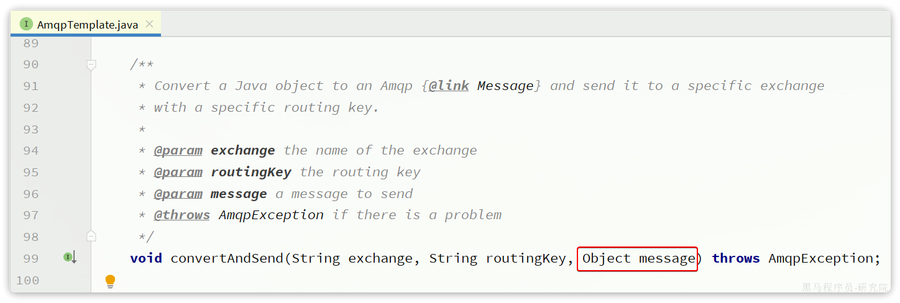

而在数据传输时，它会把你发送的消息序列化为字节发送给MQ，接收消息的时候，还会把字节反序列化为Java对象。 只不过，默认情况下Spring采用的序列化方式是**JDK序列化**。众所周知，JDK序列化存在下列问题：

> +   数据体积过大
>
> +   有安全漏洞
>
> +   可读性差
>

#### 3.5.1 配置JSON转换器

显然，JDK序列化方式并不合适。我们希望消息体的体积更小、可读性更高，因此可以使用**JSON方式**来做序列化和反序列化。

在`publisher`和`consumer`两个服务中都引入依赖：

```java
<dependency>
    <groupId>com.fasterxml.jackson.dataformat</groupId>
    <artifactId>jackson-dataformat-xml</artifactId>
    <version>2.9.10</version>
</dependency>
```

**注意，如果项目中引入了`spring-boot-starter-web`依赖，则无需再次引入`Jackson`依赖。**

配置消息转换器，在`publisher`和`consumer`两个服务的启动类中添加一个Bean即可：

配置消息转换器，在`publisher`和`consumer`两个服务的启动类中添加一个Bean即可：

```java
@Bean
public MessageConverter messageConverter(){
    // 1.定义消息转换器
    Jackson2JsonMessageConverter jackson2JsonMessageConverter = new Jackson2JsonMessageConverter();
    // 2.配置自动创建消息id，用于识别不同消息，也可以在业务中基于ID判断是否是重复消息
    jackson2JsonMessageConverter.setCreateMessageIds(true);
    return jackson2JsonMessageConverter;
}
```

消息转换器中添加的messageId可以便于我们将来做幂等性判断。

此时，我们到MQ控制台**删除**`object.queue`中的旧的消息。然后再次执行刚才的消息发送的代码，到MQ的控制台查看消息结构：

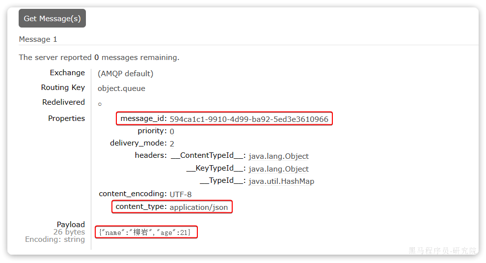

#### 3.5.2 消费者接收Object

我们在consumer服务中定义一个新的消费者，**publisher是用什么类型发送，那么消费者也一定要用什么类型接收**，格式如下：

```java
@RabbitListener(queues = "object.queue")
public void listenSimpleQueueMessage(Map<String, Object> msg) throws InterruptedException {
    System.out.println("消费者接收到object.queue消息：【" + msg + "】");
}
```

* * *

## 四、业务案例实践

案例需求：改造余额支付功能，将支付成功后基于OpenFeign的交易服务的更新订单状态接口的同步调用，改为基于RabbitMQ的异步通知。 **（也就是说，只要交易成功了，不需要等他通知完才结束交易的模块，或者说通知失败也不导致我交易服务的回滚）**如图：

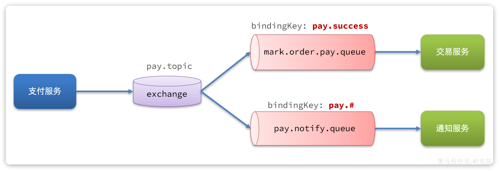

说明，我们只关注交易服务，步骤如下：

+   定义topic类型交换机，命名为`pay.topic`
    
+   定义消息队列，命名为`mark.order.pay.queue`
    
+   将`mark.order.pay.queue`与`pay.topic`绑定，`BindingKey`为`pay.success`
    
+   **支付成功时不再调用交易服务更新订单状态的接口，而是发送一条消息到`pay.topic`，发送消息的`RoutingKey` 为`pay.success`，消息内容是订单id**
    
+   交易服务监听`mark.order.pay.queue`队列，接收到消息后更新订单状态为已支付
    

### 4.1 配置MQ

不管是生产者还是消费者，都需要配置MQ的基本信息。分为两步：

#### 4.1.1 添加依赖：

```XML
  <!--消息发送-->
  <dependency>
      <groupId>org.springframework.boot</groupId>
      <artifactId>spring-boot-starter-amqp</artifactId>
  </dependency>
```

#### 4.1.2 配置MQ地址：

```java
spring:
  rabbitmq:
    host: 192.168.150.101 # 你的虚拟机IP
    port: 5672 # 端口
    virtual-host: /hmall # 虚拟主机
    username: hmall # 用户名
    password: 123 # 密码
```

### 4.2 接收消息

在trade-service服务中定义一个消息监听类：

```java
@Component
@RequiredArgsConstructor
public class PayStatusListener {

    private final IOrderService orderService;

    @RabbitListener(bindings = @QueueBinding(
            value = @Queue(name = "mark.order.pay.queue", durable = "true"),
            exchange = @Exchange(name = "pay.topic", type = ExchangeTypes.TOPIC),
            key = "pay.success"
    ))
    public void listenPaySuccess(Long orderId){
        orderService.markOrderPaySuccess(orderId);
    }
}
```

### 4.3 发送消息

修改`pay-service`服务下的`com.hmall.pay.service.impl.PayOrderServiceImpl`类中的`tryPayOrderByBalance`方法：

```java
private final RabbitTemplate rabbitTemplate;

@Override
@Transactional
public void tryPayOrderByBalance(PayOrderDTO payOrderDTO) {
    // 1.查询支付单
    PayOrder po = getById(payOrderDTO.getId());
    // 2.判断状态
    if(!PayStatus.WAIT_BUYER_PAY.equalsValue(po.getStatus())){
        // 订单不是未支付，状态异常
        throw new BizIllegalException("交易已支付或关闭！");
    }
    // 3.尝试扣减余额
    userClient.deductMoney(payOrderDTO.getPw(), po.getAmount());
    // 4.修改支付单状态
    boolean success = markPayOrderSuccess(payOrderDTO.getId(), LocalDateTime.now());
    if (!success) {
        throw new BizIllegalException("交易已支付或关闭！");
    }
    // 5.修改订单状态
    // tradeClient.markOrderPaySuccess(po.getBizOrderNo());
    try {
        // 将订单id丢到交换机，由交换机丢到消费者所在的队列
        rabbitTemplate.convertAndSend("pay.topic", "pay.success", po.getBizOrderNo());
    } catch (Exception e) {
        log.error("支付成功的消息发送失败，支付单id：{}， 交易单id：{}", po.getId(), po.getBizOrderNo(), e);
    }
}
```